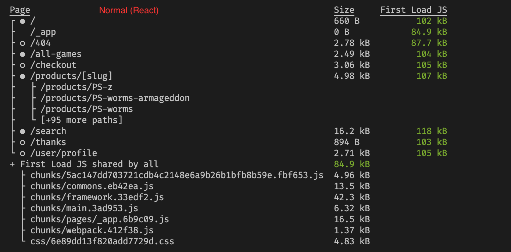
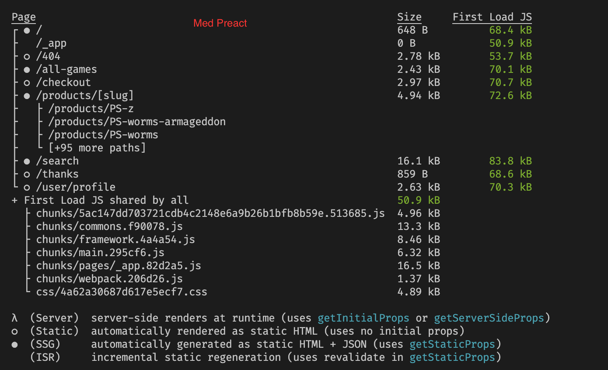
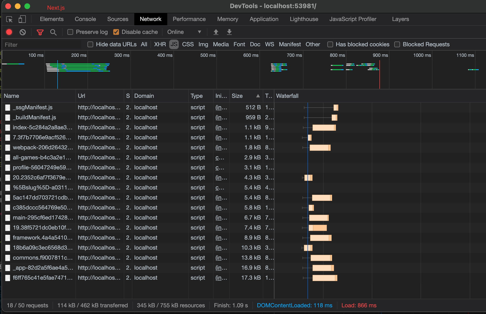
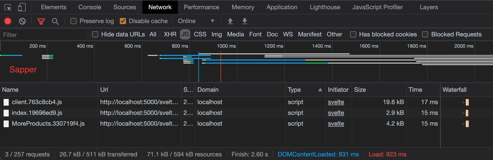

# Testbutiker

1. Next.js (React-ramverk)
2. Sapper (Svelte-ramverk)

---

# Next.js
- Bygger på React

- Stödjer både SSG och SSR

- Fil-baserad routing

- Automatisk code-splitting

- Nu på version 10

- Ny Image-komponent som delvis byggts av Google Chrome
---
# Next.js
- Använd SSG på sidor där SEO är viktigt och information sällan ändras (t.ex produktsida)
- tillåter 'revalidate'-funktion som generar ny sida efter bestämd tid 

- SSR är bra för helt dynamiska sidor (t.ex användarprofil) 

- Med Next kan man välja om en enskild sida ska genereras statiskt eller server-side
---
# Next med Preact

---
# Svelte
- Egentligen en 'compiler' snarare än ett ramverk
- Spottar ut enkel JavaScript med bara den kod som behövs
- Väldigt liten js-storlek skickas till webbläsaren 
---
# Svelte

`https://github.com/krausest/js-framework-benchmark`
---
# Sapper
- Sveltes svar på Next

- Filbaserad routing, stöd för SSR

- Version 1.0 kommer aldrig släppas

- Ersätts snart av nya Svelte Kit
---

